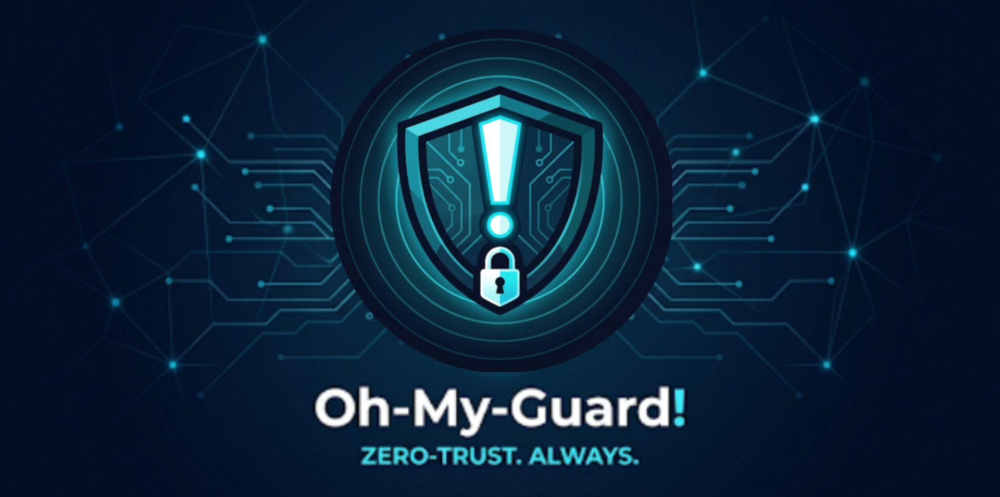

<div align="center">


# Oh-My-Guard!

### Enterprise Unified Security Platform



[](.)
[](.)
[](.)
[](.)
[](.)
[](.)

**Zero-Trust · IPS/IDS · Firewall · VPN · File Monitoring · Digital Audit**

*No Docker. No containers. Bare-metal only.*

</div>

---

## What is Oh-My-Guard!?

Oh-My-Guard! is a production-ready, unified security orchestration platform that combines everything a security operations team needs into a single native installation — no containers, no cloud dependencies, no compromises.

It runs directly on Ubuntu 22.04/24.04 LTS or Windows Server 2022/2025 and manages 500+ endpoints from a single hardened central server.

---

## Core Capabilities

| Module | Description |
|--------|-------------|
| 🛡️ **Zero-Trust Auth** | Triple verification — Certificate + MAC + IP must all match before any device connects |
| 🔥 **Firewall** | Stateful rules by IP, port, protocol, certificate — applied centrally or pushed to agents |
| 🚨 **IDS / IPS** | Signature + anomaly detection with active packet blocking via Scapy/nfqueue (Linux) and WinDivert (Windows) |
| 🔐 **VPN Management** | Create isolated networks, generate `.ovpn` files with embedded certs, enforce-only access |
| 📁 **File Monitoring** | SHA-256 hashing + user digital signatures on every file event, streamed in real-time |
| 🔑 **ACL Engine** | Granular per-user/group/device/file permissions enforced at the agent level — cannot be bypassed locally |
| 📋 **Audit Layer** | Immutable, server-signed audit trail for every security event — tamper-proof by design |
| 📊 **SOC Dashboard** | Real-time dark-theme dashboard with WebSocket alerts, live device map, and threat center |

---

## Architecture

```
┌──────────────────────────────────────────────────────────┐
│               Oh-My-Guard! Central Server                │
│   FastAPI · PostgreSQL 16 · Redis · OpenVPN · Scapy IDS  │
└──────────────────┬───────────────────────────────────────┘
                   │  TLS 1.3 + Mutual Certificate Auth
         ┌─────────┴──────────────────────┐
         │                                │
┌────────▼────────┐              ┌────────▼────────┐
│   Linux Agent   │              │  Windows Agent  │
│   (systemd)     │              │ (Windows Service)│
└─────────────────┘              └─────────────────┘
```

---

## Quick Start

### Linux Server (Ubuntu 22.04 / 24.04)

```bash
git clone https://github.com/gux-htm/securewatch.git
cd securewatch
sudo bash oh-my-guard/install/install.sh
```

### Windows Server 2022 / 2025 (PowerShell as Administrator)

```powershell
git clone https://github.com/gux-htm/securewatch.git
cd securewatch
.\oh-my-guard\install\install.ps1
```

After installation, open **https://localhost:8443** and log in as `superadmin`.

---

## Tech Stack

### Backend (Python — `oh-my-guard/`)
- **FastAPI** + Uvicorn · SQLAlchemy 2.x · Alembic · PostgreSQL 16
- **Redis** for real-time pub/sub and WebSocket relay
- **OpenVPN** + Easy-RSA managed via Python subprocess
- **cryptography** + pyOpenSSL for RSA-PSS signing and internal CA
- **Scapy** + netfilterqueue (Linux IPS) / WinDivert (Windows)
- **watchdog** + psutil for file and resource monitoring
- **HTMX** + TailwindCSS + Jinja2 for the server-rendered SOC dashboard

### Frontend (TypeScript — `artifacts/oh-my-guard/`)
- **React 19** · Vite 7 · TailwindCSS 4
- **shadcn/ui** (Radix UI primitives) · TanStack Query · Wouter · Recharts · Framer Motion

### Shared Libraries (`lib/`)
- `api-spec` — OpenAPI 3.1 spec (source of truth for all API shapes)
- `api-zod` — Auto-generated Zod schemas from OpenAPI
- `api-client-react` — Auto-generated React Query hooks from OpenAPI
- `db` — Drizzle ORM schema + PostgreSQL connection

---

## Project Structure

```
/
├── oh-my-guard/            # Python/FastAPI native backend
│   ├── server/             # FastAPI app, routers, services, middleware
│   ├── agent/              # Lightweight Python client daemon
│   ├── vpn/                # OpenVPN + Easy-RSA management
│   ├── crypto/             # Internal CA, RSA-PSS signing
│   ├── dashboard/          # HTMX + Jinja2 SOC dashboard templates
│   ├── database/           # SQLAlchemy models + Alembic migrations
│   └── install/            # install.sh (Linux) + install.ps1 (Windows)
├── artifacts/
│   ├── oh-my-guard/        # React SPA frontend
│   └── api-server/         # Express 5 API server
├── lib/
│   ├── api-spec/           # OpenAPI 3.1 spec + Orval codegen
│   ├── api-client-react/   # Generated React Query hooks
│   ├── api-zod/            # Generated Zod schemas
│   └── db/                 # Drizzle ORM schema
├── assets/brand/           # Logo, icons, splash screen
└── scripts/                # Utility TypeScript scripts
```

---

## Security Principles

- **Zero-trust everywhere** — no device is trusted by default, ever
- **TLS 1.3 + mutual certificate authentication** on all server ↔ agent communication
- **Immutable audit logs** — cryptographically signed with the server master key, append-only
- **Bare-metal only** — no Docker, no containers, no virtualization layer
- **Least privilege** — all services run as non-root where possible
- **Automatic key rotation** and certificate renewal built-in

---

## Roles

| Role | Access |
|------|--------|
| Super Admin | Full system access — all networks, all devices, all settings |
| Network Admin | Manage assigned networks, devices, firewall rules, VPN |
| Auditor | Read-only access to audit logs, alerts, and reports |

---

<div align="center">


**ZERO-TRUST. ALWAYS.**

</div>
